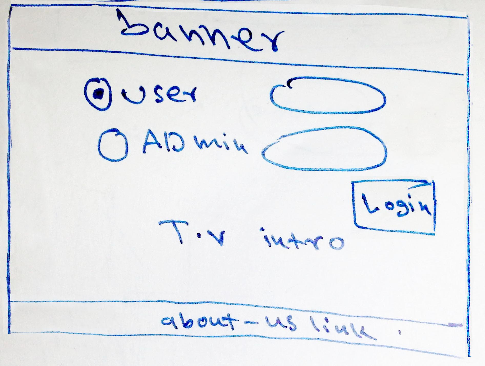
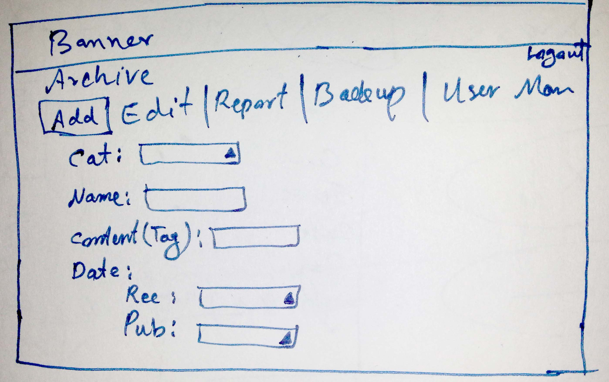
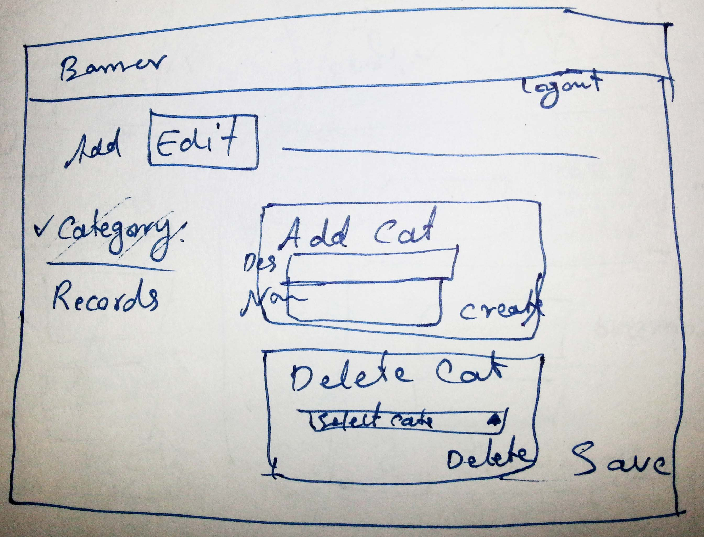
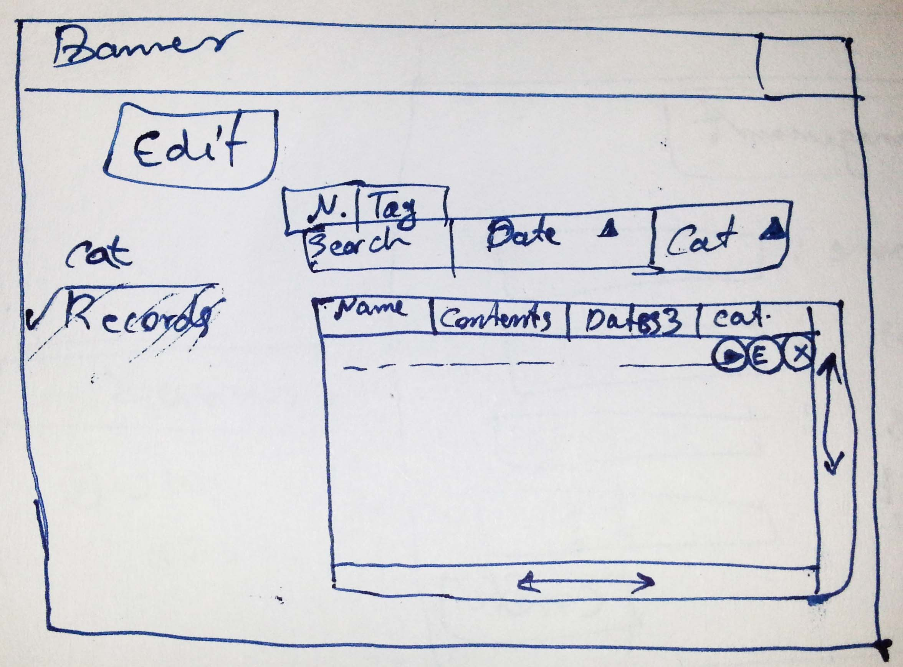
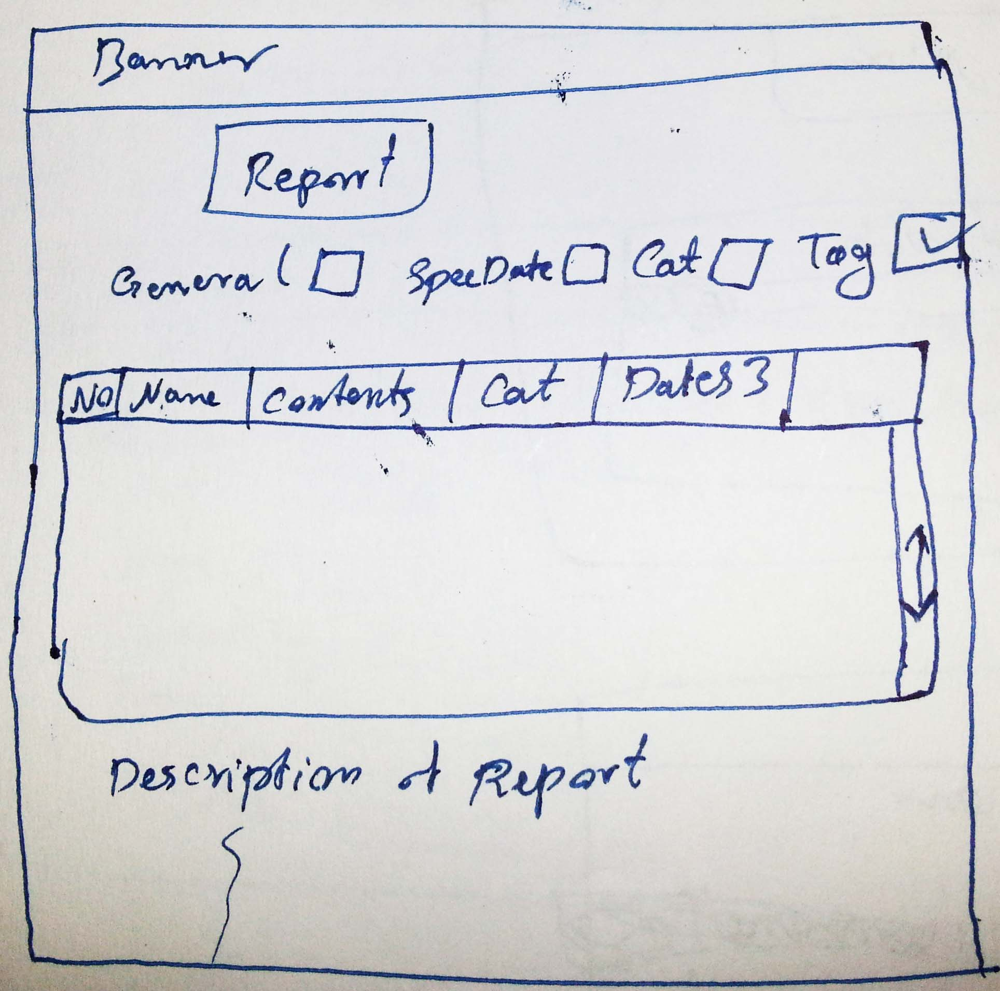
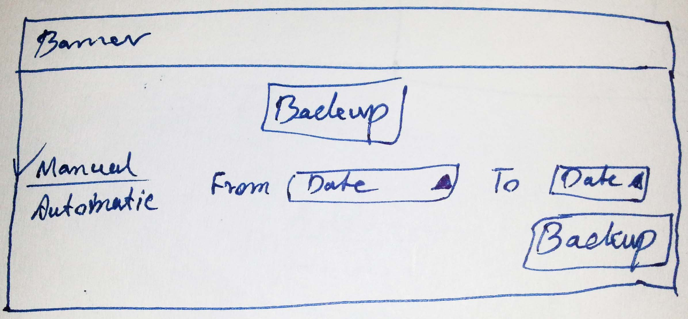
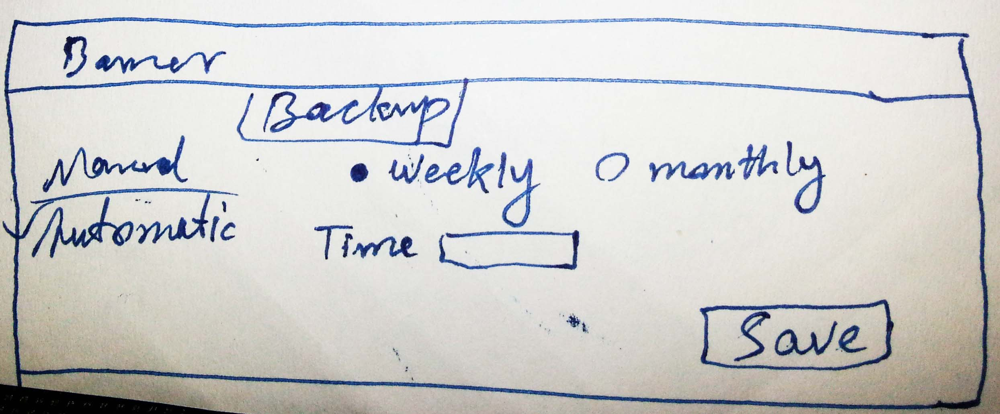
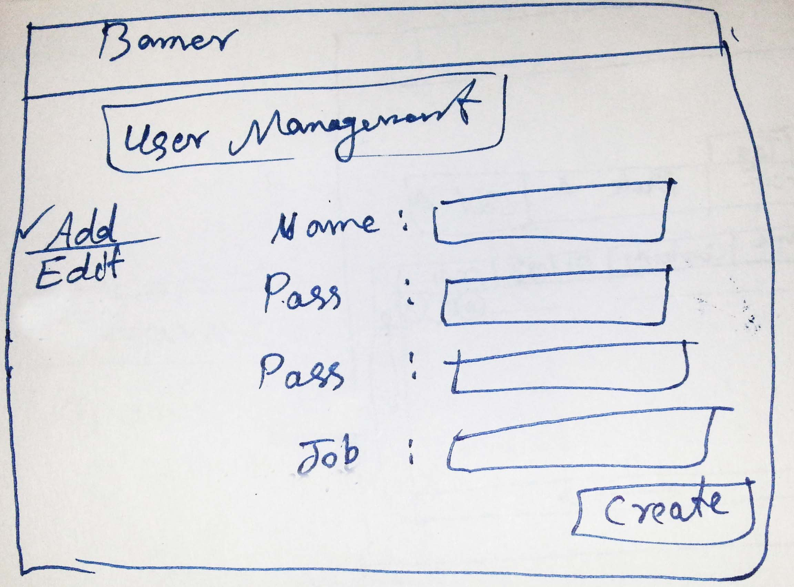
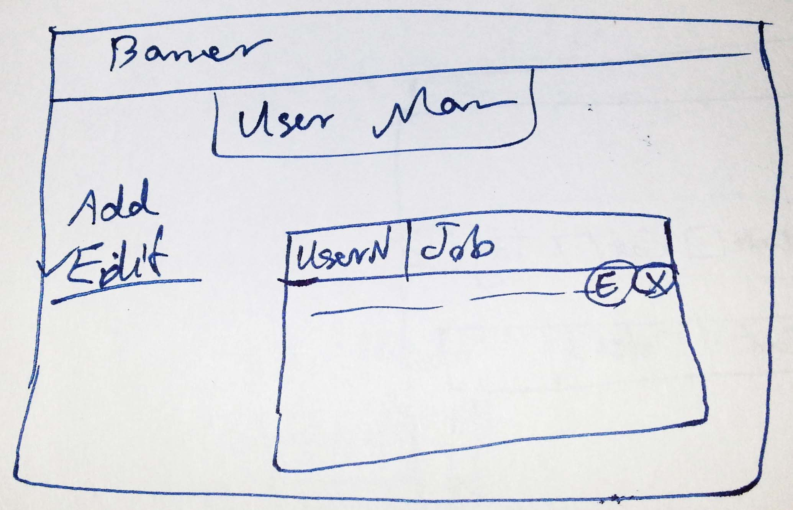
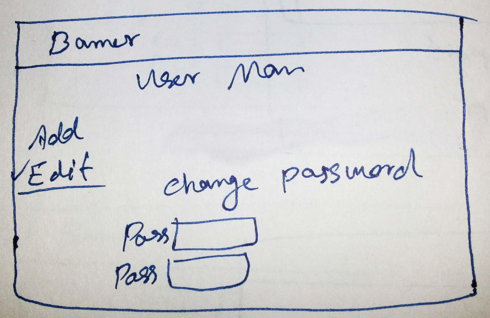

                                                    786
#User Interface (Paper Prototype)

Fig1: Home Page  
    

Fig2: Administration Add/Insertion Tab  
   

Fig3: Administration Category-Edit Tab  
  

Fig4: Administration Records-Edit Tab  
  

Fig5: Administration Report Tab  
  

Fig6: Administration Backup-Manual Tab  
  

Fig7: Administration Backup-Automatic Tab  
  

Fig8: Administration UserManagement-Add User Tab   

Fig9: Administration UserManagement-Edit Users Tab  
  

Fig10: Administrative/User UserManagement-Change Password Tab  

 

                                                                   The Alpha Team